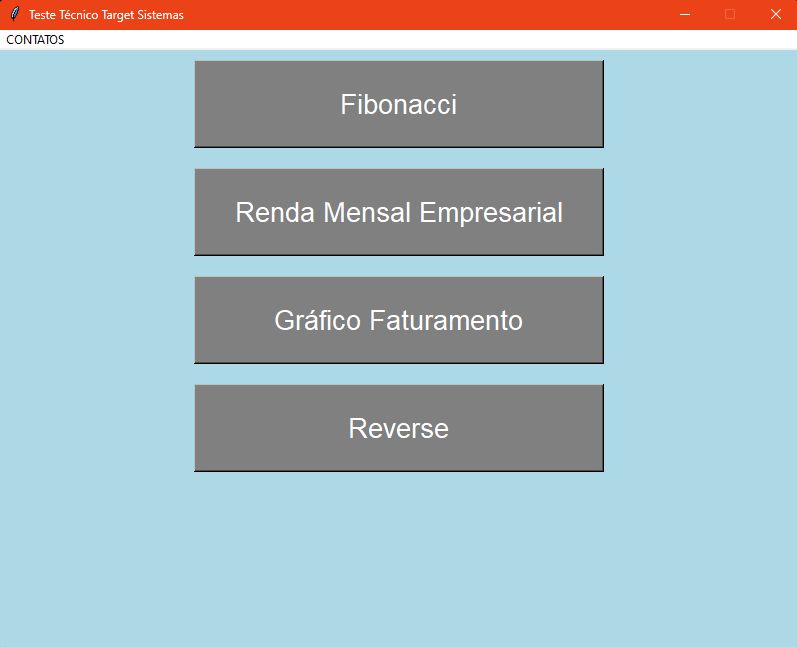
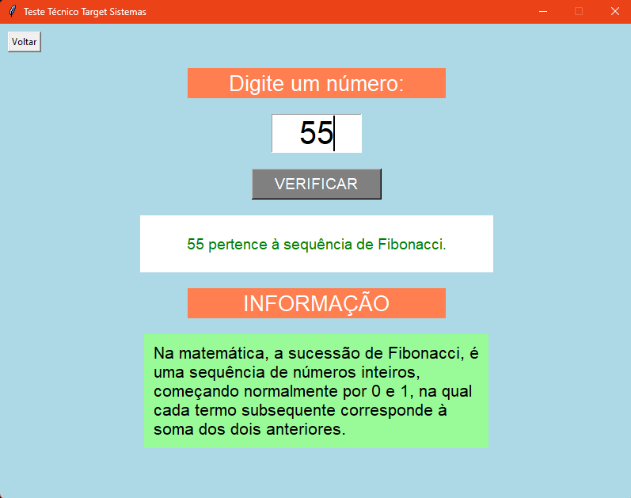
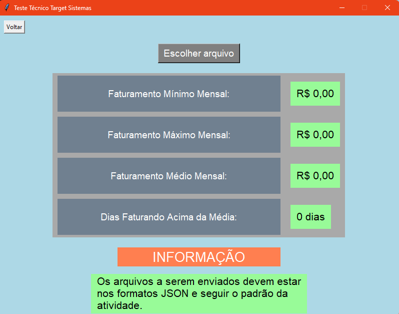
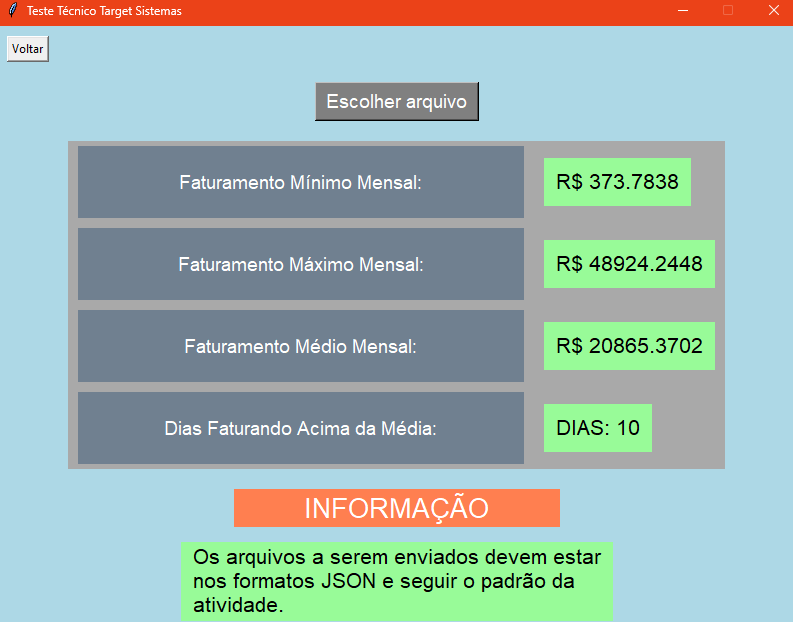
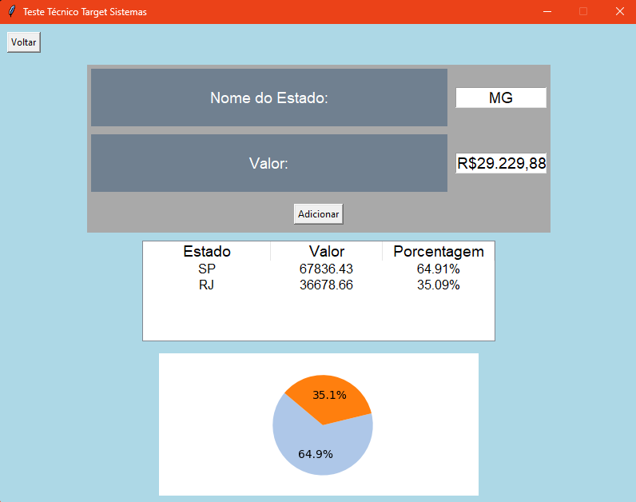
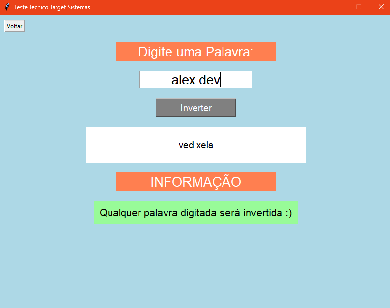

# Desafios Target!

> Este repositório tem como objetivo abordar os desafios técnicos da Target Sistemas de maneira robusta. O programa visa atender a todas as propostas e integrá-las de forma a facilitar a visualização por meio do Tkinter (ou QT).

# Tecnologias Utilizadas

-  Python
-  Qt (Tkinter)

# Tutorial

> Para utilizar ou testar este repositório, você tem duas opções:

- Clonar o repositório e executar o arquivo app.exe.
- Clonar o repositório, instalar todas as dependências e, em seguida, executar o código a partir do arquivo app.py."

## Cuidados

- Não mudar a hierarquia dos arquivos, isto irá causar mal funcionamento.
- Utilizei a versão do python 3.11.2, talvez o código não funcione corretamente em outras versões menores.

## Fibonacci (Desafio 2)

> "Na matemática, a sucessão de Fibonacci, é uma sequência de números inteiros, começando normalmente por 0 e 1, na qual cada termo subsequente corresponde à soma dos dois anteriores." - [Wikipédia](https://pt.wikipedia.org/wiki/Sequência_de_Fibonacci)

> Nesta área do programa, você pode inserir qualquer valor numérico. Ao clicar no botão 'Verificar', uma mensagem será exibida no rótulo abaixo, informando se o valor faz parte da sequência de Fibonacci ou não. A inserção de símbolos ou letras não causará erros; uma mensagem de alerta será exibida solicitando que apenas valores numéricos sejam inseridos.

## Renda Mensal Empresarial (Desafio 3)

> No desafio 3 foi proposto utilizar um arquivo .JSON ou XML com dados sobre faturamentos diários de uma empresa, optei por utilizar o json pela facilidade de manipulação.

> Se você clonou o repositório, os arquivos .json estarão localizados na pasta files/. Com esses arquivos, ou qualquer outro arquivo com a mesma extensão e estrutura adequada, clique em 'Escolher arquivo'. O programa atualizará os valores em verde e exibirá a seguinte mensagem:

- O menor faturamento.
- O maior faturamento.
- O faturamento médio é calculado somando o faturamento de todos os dias úteis (excluindo feriados e dias não úteis) e, em seguida, dividindo o total pelo número de dias úteis considerados.
- Quantos dias o faturamento superou a mediana.

## Gráfico Faturamento (Desafio 4)

> No quarto desafio foi solicitado um programa que possa receber valores faturados por uma distribuidora em alguns estados, por Exemplo:

- SP – R$67.836,43
- RJ – R$36.678,66
- MG – R$29.229,88
- ES – R$27.165,48
- Outros – R$19.849,53

> Criei um programa onde o usuário pode inserir produtos, estados ou qualquer outro item para calcular a porcentagem correspondente. À medida que os dados são inseridos, o programa exibe um gráfico atualizado em tempo real e apresenta as informações em uma tabela, facilitando a visualização dos valores adicionados.

> Você pode inserir o valor de forma totalmente numérica, utilizando pontos, vírgulas ou o símbolo de reais, como mostrado na imagem e nos exemplos. O input será automaticamente formatado e convertido em um valor numérico válido.

## Reverse (Desafio 5)

> Na última tarefa, precisei criar uma função que invertesse qualquer string passada para ela, sem utilizar funções nativas da linguagem.

> Boa diversão!
